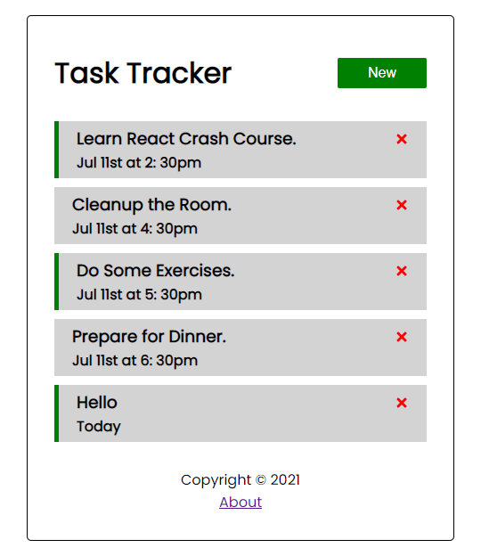

# A Task Tracker Website with Reactjs

This website is built by following the instruction of Traversy Media tutorial in the purpose of learning website development.



## What to Learn

- Basic concepts and steps to build a Reactjs website.
- Use json-server to mock API.
- Use react-router-dom to navigate between pages.
## References

- https://www.youtube.com/watch?v=w7ejDZ8SWv8
- https://www.npmjs.com/package/json-server

## How to Start

### Install Dependencies
```
yarn install
```

### Run the Mock JSON Server
```
yarn run server
```

### Run the Web
Open new terminal and run
```
yarn start
```

## Build for Production
```
yarn build
```
